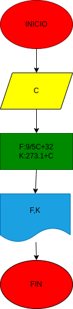

# Ejercicio No. 2

# Temperatura

## Programa para conversiones de temperatura 

# ANALISIS

Variables de entrada (input)

C: Grados centigrados

Variables de proceso y salida (processing, storage, output)

F:Grados farenheit
K:Grados kelvin

# CONSTRUCCION
